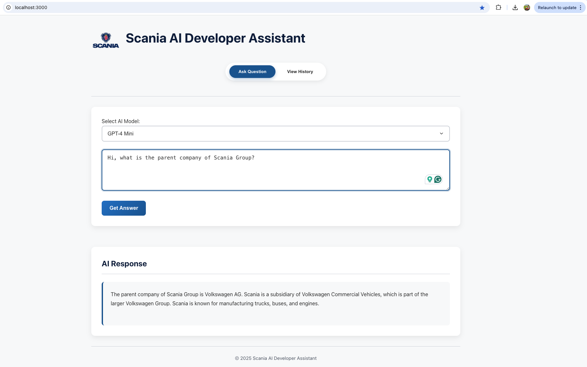
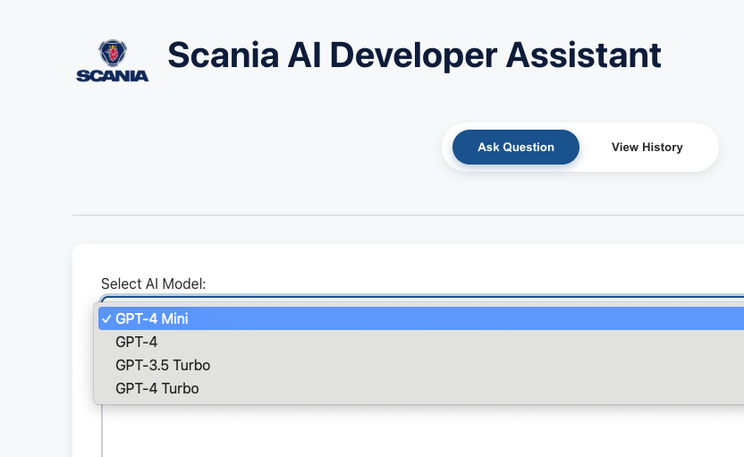
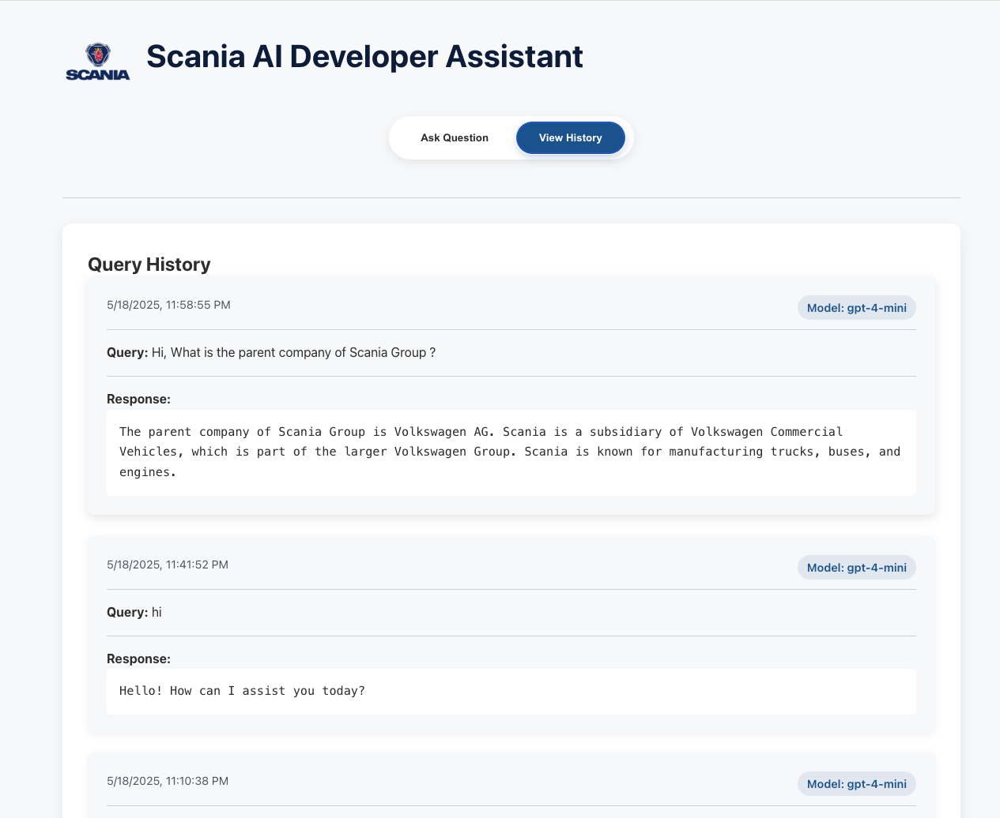

# Scania AI Developer Assistant

An advanced AI-powered full-stack developer assistant designed for Scania engineering teams, offering multi-model support, comprehensive query history, and real-time responses through a modern interface. Built with Azure OpenAI integration and robust containerized architecture.


## 🌐 Live Demo
Experience the power of AI developer assistance:
- Frontend: https://scania-ai-assist-1.onrender.com/
- Backend API: https://scania-ai-assist.onrender.com/health

Give it a spin! Feel free to explore the capabilities with your development queries. Note: This demo uses a personal API key for demonstration purposes - let's keep the queries focused and meaningful. Happy coding! 🚀

## 📸 Screenshots

### Query Interface


### Model Selection


### Query History View
<p align="center">
   
</p>

## 🎯 Key Features

* 🤖 **Multiple AI Model Support**
  - GPT-4 Mini
  - GPT-4
  - GPT-3.5 Turbo
  - GPT-4 Turbo
  - Dynamic model selection for different use cases

* 📝 **Enhanced Query System**
  - Real-time query processing
  - Interactive query form with model selection
  - Detailed response tracking
  - Loading states and error handling

* 📚 **Comprehensive Query History**
  - Chronological display of past queries
  - Timestamps for each interaction
  - Model-specific tracking
  - Easy toggle between query and history views

* 🎨 **Modern UI/UX**
  - Glass-morphism design
  - Responsive layout
  - Interactive loading states
  - Error feedback
  - Clean component separation

## 🛠 Technology Stack

### Frontend
* React 19 with TypeScript
* Modern component architecture
* State management for real-time updates
* Axios for API communication
* Responsive styling with glass-morphism

### Backend
* Express.js with TypeScript
* MongoDB Atlas integration
* Azure OpenAI SDK with multi-model support
* Winston logging system
* RESTful API architecture

## 🚀 Getting Started

### Prerequisites
* Docker & Docker Compose
* Azure OpenAI Service API Key
* MongoDB Atlas account

### Environment Setup
Create a `.env` file with:
```bash
AZURE_OPENAI_ENDPOINT=your_azure_endpoint
AZURE_OPENAI_API_KEY=your_azure_api_key
AZURE_OPENAI_DEPLOYMENT_NAME=your_deployment_name
MONGODB_USERNAME=your_mongodb_username
MONGODB_PASSWORD=your_mongodb_password
```

### Launch Application
```bash
docker-compose up --build
```

Access at: http://localhost:3000

## 📡 API Endpoints

### POST /api/query
Submit a developer query with model selection.

Request:
```json
{
  "query": "How do I implement async/await in TypeScript?",
  "model": "gpt-4"
}
```

Response:
```json
{
  "success": true,
  "data": {
    "id": "507f1f77bcf86cd799439011",
    "query": "How do I implement async/await in TypeScript?",
    "response": "Here's how to use async/await...",
    "model": "gpt-4",
    "timestamp": "2024-02-15T10:30:15.123Z"
  }
}
```

### GET /api/queries
Retrieve query history with model information.

## 📂 Project Structure
```
scania-ai-assist/
├── .env                       # Environment variables (gitignored)
├── .env.example               # Example environment variables
├── .gitignore                 # Git ignore file
├── docker-compose.yml         # Docker compose configuration
├── README.md                  # Project documentation
│
├── backend/                   # Backend Express application
│   ├── Dockerfile             # Backend Docker configuration
│   ├── package.json           # Backend dependencies
│   ├── tsconfig.json          # TypeScript configuration
│   └── src/
│       ├── index.ts           # Entry point
│       ├── app.ts             # Express app setup
│       ├── config/            # Configuration files
│       │   ├── database.ts    # Database configuration
│       │   └── env.ts         # Environment variables
│       ├── controllers/       # API controllers
│       │   └── queryController.ts
│       ├── models/            # Database models
│       │   └── query.ts
│       ├── routes/            # API routes
│       │   └── queryRoutes.ts
│       ├── services/          # Business logic
│       │   └── llmService.ts
│       └── utils/             # Utility functions
│           └── logger.ts      # Logging utility
│
└── frontend/                  # Frontend React application
    ├── Dockerfile             # Frontend Docker configuration
    ├── package.json           # Frontend dependencies
    ├── tsconfig.json          # TypeScript configuration
    ├── public/                # Public assets
    └── src/
        ├── App.tsx            # Main application component
        ├── index.tsx          # Entry point
        ├── components/        # React components
        │   ├── QueryForm.tsx  # Form for submitting queries
        │   └── ResponseArea.tsx # Display for assistant responses
        ├── services/          # Frontend services
        │   └── api.ts         # API communication
        └── types/             # TypeScript type definitions
            └── index.ts
```

## 📄 License
This project is licensed under the [GNU General Public License v3.0](LICENSE).
